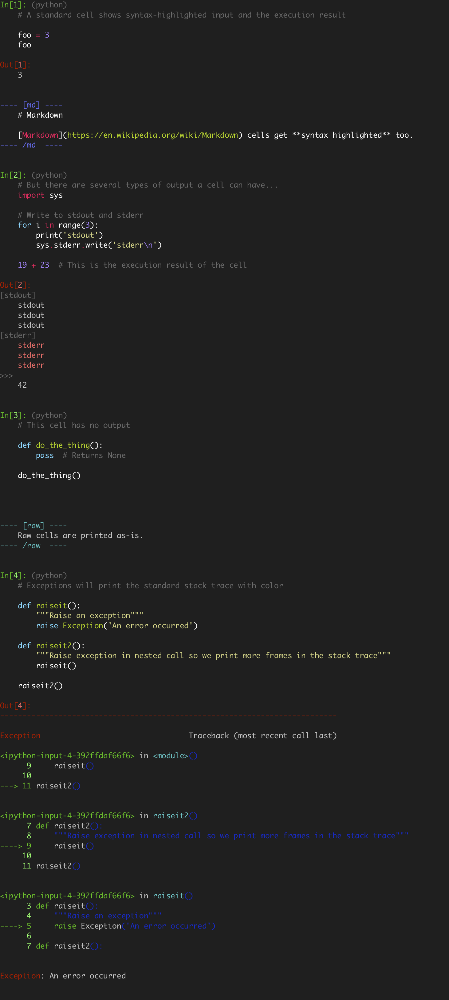

# nbconvert-terminal

Extends `jupyter nbconvert` to enable viewing contents of `.ipynb` files in the terminal.

## Command line usage

The package defines a new Jupyter command, `nbview`, which is a modified version of `nbconvert` that runs the terminal exporter and prints to stdout. The general form is

    jupyter nbview [--style <style>] notebook.ipynb
    
where the `--style` option sets the syntax highlighting style to use with [pygments](http://pygments.org/). Use

    jupyter nbview --list-styles
    
to list all available styles. See the [example](#example) below.

## Installation

Just run `python setup.py install`.

## Configuration

This package uses Jupyter's `nbconvert` system internally and shares the same configuration file. This is usually in `~/.jupyter/jupyter_nbconvert_config.py`. If it doesn't exist, you can create it with `nbconvert --generate-config`. Probably the only one worth using is the `syntax_style` trait:

    c.TerminalExporter.syntax_style = 'monokai'
    
    
## Details

Note: styles are only enabled in 256 color mode, which is enabled by default if your terminal
emulator supports it. You can also force this using the `--256color` flag.

If you want to page through the output by piping it through `less`, use the `-r` argument:

    jupyter nbview [--style <style>] notebook.ipynb | less -r

The terminal exporter is also made available under the old `nbconvert` command:

    jupyter nbconvert -to terminal notebook.ipynb

## Example

Example output for viewing this [example notebook](example/example.ipynb):

    jupyter nbview --style=monokai example/example/ipynb

</img>
